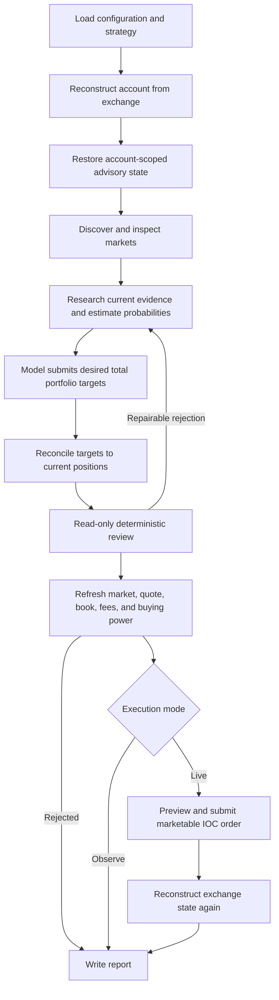

# MarketCaster

MarketCaster is an open-source prediction-market trading engine for Polymarket
US and Kalshi. Each cycle reconstructs the selected exchange account, discovers
and researches active markets, asks a model for desired total portfolio
exposures, reconciles those targets against current positions, and applies
deterministic validation before any order can reach an exchange.

MarketCaster runs in observe mode by default. Its reference mode presents the
exchange catalog and allocates no BUY capital. Optional modules customize
selection, forecasting, and allocation through a versioned interface.

> [!WARNING]
> MarketCaster is experimental software, not financial, investment, legal, or
> tax advice. Prediction-market trading can lose all committed funds. Models,
> market data, and exchange APIs can be wrong, stale, or unavailable. You are
> responsible for exchange rules and applicable law. Use this software at your
> own risk.

## Components and extensions

MarketCaster includes exchange adapters, account reconstruction, market
discovery, research tools, provider integrations, portfolio reconciliation,
risk and evidence validation, execution guards, reporting, state/memory, and
the CLI.

The repository includes reference configuration, prompt contracts, and synthetic
checks. A trusted policy module receives a versioned API; it cannot replace
risk assessment or submit orders through that API.

A policy module is optional for catalog-only reference runs. A configured custom
selection variant without a policy module fails before exchange initialization.

## Supported exchanges

| Exchange      | `EXCHANGE_ID`   |
| ------------- | --------------- |
| Polymarket US | `polymarket-us` |
| Kalshi        | `kalshi`        |

Polymarket support targets the Polymarket US retail API. It does not implement
Polymarket International wallet authentication, USDC collateral, or the
international CLOB.

Kalshi support targets the Prediction Trade API v2, including live and
historical data tiers. Trading is intentionally limited to primary subaccount 0
and exchange index 0. Multivariate markets and nonzero exchange shards are
excluded until their account and settlement semantics are modeled.

## Architecture



The exchange remains the source of truth for balances, positions, open orders,
fills, settlements, and recent account activity. Local state is advisory; it
does not reconstruct the trading account or authorize an order.

## Market discovery and research

The full supported exchange catalog is available through paginated discovery.
A bounded opportunity board provides a starting point while category, tag,
event, series, keyword, volume, movement, spread, depth, open-interest, price,
expiry, and data-age filters can explore the wider universe. Exact market and
market-family tools fetch settlement rules and current quotes on demand.

The reference board uses exchange order. Optional grouping and bounded
enrichment mechanisms accept callbacks. Configuration controls safety and
resource limits.

Discovery output is untrusted catalog evidence. It never establishes settlement
identity, source validity, correlation, executable liquidity, or permission to
trade. Those facts are checked later against exact market details and refreshed
exchange state.

Set `cycle.stageBudgetsSeconds.marketDiscovery` to `null` in a deployment's
complete configuration to use the overall cycle deadline without a separate
discovery timer. A positive integer retains a discovery limit in seconds.
The overall `cycle.timeoutSeconds` and other stage budgets still apply.
Polymarket US quote sides returned as `null` are treated as absent liquidity;
any present side retains the normal quote validation.

Research tools support current web search, bounded reads of URLs already
observed in the cycle, market analysis, and non-binding trade previews. Evidence
used for a probability-bearing decision must match an observed URL and exact
source excerpt. Deterministic validation checks evidence provenance, freshness,
source independence, settlement facts, and decision coverage.

## Decision providers

Built-in providers support OpenAI's Responses API and Anthropic. An optional
`LLM_CATALOG_MODEL` can perform the bounded catalog-narrowing phase before the
primary `LLM_MODEL` takes ownership of web research, evidence reads, analysis,
previews, state changes, final decisions, and repair rounds.

The provider does not place orders. It returns desired total exposures and
supporting audit fields. The same deterministic validator reviews terminal
plans for both providers and may return structured read-only repair feedback.
Any repaired plan is validated again against fresh exchange state.

## Portfolio reconciliation and execution

The model returns `targetCostBasisFraction`: desired total same-side cost basis
as a fraction of current risk equity. It does not return a one-shot order size.
An explicit zero requests an exit. Every holding must receive a target.

A pure reconciler computes the remaining BUY or SELL delta from the
authoritative cycle-start position. Kelly sizing, concentration, buying power,
cycle spend, spread, fees, source requirements, and book depth can shrink or
reject it. A later cycle recomputes only the remaining gap from newly
reconstructed exchange state.

Live orders use marketable limits. SELLs and deployments without managed
resting BUYs use immediate-or-cancel, so any unfilled remainder is canceled.
Polymarket US also supports deployment-configured, bounded good-till-date BUY
execution. When enabled, marketable quantity may fill immediately and any
remainder may rest until the runtime-set expiration. Configuration limits that
lifetime to at most 15 minutes.

`risk.allowPositionReductions` defaults to `true`. Set it to `false` in the
existing JSON configuration to reject canonical SELL YES and SELL NO actions,
including trims, zero-target exits, and emergency exits, with
`POSITION_REDUCTION_DISABLED`. BUY actions keep every existing safeguard; BUY
NO remains a BUY even when its exchange order side is SELL. Cancellations and
exchange settlement are unaffected. Validation excludes blocked sale proceeds
from allocation, and execution independently checks the actual order before
submission. Agent context (including custom prompts), previews, and observe
mode use the same capability. Blocked targets remain recorded as requested
reductions with their rejection and cannot be repaired into a policy override.

Merge this single field into the existing `risk` object of the complete file
selected by `MARKETCASTER_CONFIG_PATH`; no additional environment or prompt
setting is needed. Omission or `true` preserves existing behavior; other types
are invalid.

```json
{
  "risk": {
    "allowPositionReductions": false
  }
}
```

## Safety and correctness

Safety mechanisms remain part of the public engine:

- Observe mode submits no orders.
- Prices, quantities, fees, PnL, and exposure use decimal arithmetic.
- Account state is reconstructed from exchange data before and after decisions.
- Every live order refreshes market state, quote, order book, fees, and buying
  power and performs the exchange-specific preview or equivalent validation.
- Stale state, invalid settlement data, unsupported evidence, wide spreads,
  insufficient depth, and invalid sizes fail closed.
- Naked shorts, leverage, unmanaged or unbounded resting orders, duplicate
  orders, and automatic create-order retries are prohibited.
- Unexpected open orders disable live execution for that cycle.
- Partial fills are accepted and reconciled. An ambiguous submission stops the
  remaining cycle.
- Account-scoped state cannot cross exchange accounts or configured model
  profiles.
- Live cycles use a per-exchange lock and inspect durable journals before new
  account or order work.

The checked-in values in `config/default.json` are conservative reference
values. Review them and complete observe-mode validation before enabling live
execution.

## Installation

Requirements:

- Node.js 22.x
- npm
- A dedicated Polymarket US or Kalshi account with API credentials
- An OpenAI or Anthropic API key

Copy `.env.example` to `.env`, fill in the selected exchange credentials,
provider, model, and `LLM_API_KEY`, and leave `TRADING_MODE=observe` during
setup. MarketCaster reads process environment variables and does not load
`.env` automatically.

```sh
npm ci
npm run build
node --env-file=.env dist/src/index.js
```

The public checkout is sufficient for all three commands.

## Observe and live modes

`TRADING_MODE=observe` performs account reconstruction, discovery, research,
target reconciliation, deterministic validation, simulated execution reporting,
and state/report persistence without submitting orders.

`TRADING_MODE=live` enables order submission only after the same checks pass. It
must be set explicitly. A missing or unrecognized value resolves to observe for
mode selection and is rejected by full environment validation when invalid.

Do not perform a live run merely to test configuration changes. Revoke the
selected exchange key if an active process must lose access immediately.

## Configuration

The full public schema and reference defaults live in
[`config/default.json`](config/default.json). Runtime settings are supplied by
environment variables:

| Name                                | Use                                                             |
| ----------------------------------- | --------------------------------------------------------------- |
| `EXCHANGE_ID`                       | `polymarket-us` or `kalshi`.                                    |
| `TRADING_MODE`                      | `observe` or `live`; defaults to `observe`.                     |
| `LLM_PROVIDER`                      | `openai` or `anthropic`.                                        |
| `LLM_BASE_URL`                      | Optional trusted OpenAI-compatible API root.                    |
| `LLM_MODEL`                         | Primary decision and repair model.                              |
| `LLM_CATALOG_MODEL`                 | Optional same-provider catalog model.                           |
| `LLM_API_KEY`                       | Selected provider API key.                                      |
| `POLYMARKET_KEY_ID`                 | Polymarket US key identifier.                                   |
| `POLYMARKET_SECRET_KEY`             | Polymarket US signing secret.                                   |
| `KALSHI_API_KEY_ID`                 | Kalshi API key identifier.                                      |
| `KALSHI_PRIVATE_KEY`                | Kalshi RSA private key.                                         |
| `KALSHI_API_BASE_URL`               | Optional official Kalshi Trade API v2 root.                     |
| `AGENT_MEMORY_SCOPE`                | Optional stable non-secret profile label.                       |
| `MARKETCASTER_STRATEGY_PATH`        | Optional trusted ESM policy factory implementing API version 1. |
| `MARKETCASTER_CONFIG_PATH`          | Optional complete configuration JSON file.                      |
| `MARKETCASTER_DECISION_PROMPT_PATH` | Optional decision system-prompt file.                           |
| `MARKETCASTER_REPORT_DIR`           | Optional report and persistent-state root.                      |

Relative override paths resolve from the process working directory. Absolute
paths are also supported. An override is used only when explicitly supplied:

```text
override supplied -> read and validate that exact file/path
override absent   -> use the checked-in public default
```

An explicit missing file, malformed JSON document, or schema-invalid
configuration fails the cycle. MarketCaster never silently falls back from a
requested file. `MARKETCASTER_CONFIG_PATH` replaces the complete config
rather than merging fragments, which keeps validation deterministic.

`MARKETCASTER_REPORT_DIR` changes the root without changing report or state
schemas. Notes, beliefs, advisories, histories, journals, locks, and the shadow
ledger keep their existing relative layout beneath that root.

## Strategy configuration

The public reference prompt is
[`config/prompt/decision/reference/system.md`](config/prompt/decision/reference/system.md).
The adjacent user template, research-tool descriptions, and tool messages are
part of the engine contract and remain public.

Set the documented path variables to select a configuration file, trusted
policy module, decision system prompt, or report directory. Relative paths
resolve from the working directory. The same validation and execution checks
apply to all configurations.

## Reports and persistent state

Each cycle is journaled under `reports/runs/<runId>/<cycleId>/` by default.
Decision, validation, order intent, provider rounds, execution outcome, and
reconciliation records are written incrementally. The report schemas are
unchanged by path overrides.

`reports/current/index.json` atomically points to one terminal run. A bounded
account history lives under `reports/history/`, while completed advisories,
notes, typed beliefs, plans, and shadow-ledger state retain their existing
account-scoped locations. Missing, corrupt, incompatible, or cross-account
advisory state is ignored or quarantined according to the existing fail-closed
rules; it never changes exchange balances or positions.

`reports/` is ignored by Git. Keep the entire report root in access-restricted
storage. Reports may contain positions, trades, theses, probabilities, beliefs,
and execution history.

Preserve the complete report root when changing `MARKETCASTER_REPORT_DIR`.
Complete prior journals are required for recovery from an ambiguous order
submission.

## Development and contributions

There is currently no general automated test suite. Use the checks that exist in
`package.json`:

```sh
npm ci
npm run format:check
npm run lint
npm run typecheck
npm run build
npm run check:overrides
```

`check:overrides` is a small migration regression check. It verifies default
loading, explicit config and prompt selection, report-root precedence, fallback
restoration after removing overrides, malformed configuration failure, and
explicit missing-file failure.

For runtime changes, perform an observe-mode cycle with public defaults and then
with temporary override files. Do not use live execution as a smoke test.

Contributions should keep exchange behavior, reconciliation, deterministic
validation, report formats, state isolation, and failure semantics explicit and
reviewable. Strategy experiments should use configuration or alternate prompts
when they do not require an engine change.

## License

Licensed under the [ISC License](LICENSE).
