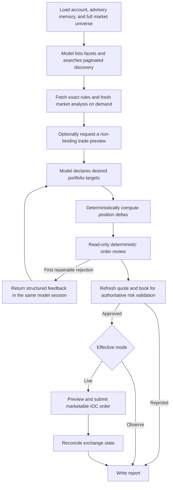

# MarketCaster

MarketCaster is an exchange-state-reconstructing trading agent for Polymarket
US and Kalshi. Each run rebuilds the account from exchange data, researches
active markets, asks a model for desired total portfolio exposures, reconciles
those targets against current positions, and applies deterministic risk checks
before any derived order can reach the selected exchange. It
runs in observe mode by default when invoked locally and can retain bounded
advisory notes, typed beliefs, and research plans. The checked-in scheduled
workflow runs in live mode.

MarketCaster is inspired by [Prediction Arena](https://predictionarena.ai/),
which evaluates AI agents through autonomous prediction-market trading.

> [!WARNING]
> MarketCaster is experimental software, not financial, investment, legal, or
> tax advice. Prediction-market trading can lose all funds committed. Models,
> market data, and exchange APIs can be wrong, stale, or unavailable. You are
> responsible for following exchange rules and applicable law. Use this software
> at your own risk; its authors and contributors are not responsible for trading
> losses or other damages.

## Supported exchanges

| Exchange      | `EXCHANGE_ID`   |
| ------------- | --------------- |
| Polymarket US | `polymarket-us` |
| Kalshi        | `kalshi`        |

Polymarket support targets the Polymarket US retail API. It does not include
Polymarket International, wallet authentication, USDC collateral, or the
international CLOB.

Kalshi support targets the Prediction Trade API v2, including its live and
historical data tiers. Trading is intentionally limited to primary subaccount
0 and exchange index 0; multivariate (combo) markets and nonzero exchange
shards are excluded until their account and settlement semantics are modeled.

## How it works



The full exchange market universe remains available to the model through
paginated discovery. Each cycle also supplies a compact opportunity board of up
to 40 unheld markets. It combines an exchange-ranked lane with a bounded,
deterministic family-scout lane that surfaces recurring dated instances and
multi-contract ladders that may be buried far below the top-volume markets.
The scout enriches at most 24 representative markets, scores liquidity or
near-touch depth (35%), 24-hour volume (25%), price uncertainty (25%), exchange
rank (10%), and capped recurrence (5%), and prefers useful middle ladder strikes
over extreme endpoints. Its selected lane admits at most three markets per
category and two climate or weather markets before exchange-rank backfill.
Board entries are catalog metadata, not researched or trade-eligible markets.
A compact facet tool enumerates category, tag, event, and series selectors
present in the current catalog metadata, with market counts. Search and
agent-selected volume, movement, spread, depth,
open-interest, price-band, and data-age filters then surface manageable pages
for context. Discovery responses expose their remaining shared request budget;
opaque cursors are session-signed and bound to the exact query, and duplicate
calls are rejected without another exchange read. Broad book-backed filtering
must first be narrowed with cheap catalog metadata so quality rankings are
never computed from a biased partial sample. Exact market details and fresh
book analysis are fetched on demand; no fixed shortlist hides the remaining
markets.

This policy is provider- and category-neutral for Polymarket US and Kalshi:
both adapters expose the complete supported catalog, and MarketCaster uses no
curated benchmark list. Category is descriptive metadata and an optional
model-selected discovery filter; the diversity caps apply only to the bounded
scout lane. The scout prefers
exchange-native event and series identifiers; when those are absent, it may use
deterministic slug/date structure as an explicitly advisory discovery hint.
Inferred scout keys never define settlement identity, correlation, evidence
sharing, risk aggregation, or execution behavior.

The model does not choose one-shot order sizes. It returns
`targetCostBasisFraction`, the desired total same-side cost basis as a fraction
of current risk equity. An explicit zero requests an exit. Every held position
and every mechanically qualified candidate that receives deeper analysis, a
trade preview, or focused attributed web research must appear exactly once:
either as a target or as a structured `HOLD_UNCHANGED`/`PASS` disposition.
Opening details only for triage or family comparison does not create a terminal
disposition requirement. A pure reconciler computes at most one BUY or SELL
delta per target from the authoritative cycle-start snapshot. Kelly,
concentration, buying-power, cycle-spend, spread, source, fee, and depth checks
can reduce or reject that delta; a later cycle recomputes only the remaining
gap. This contract is identical across model providers.

The exchange is the source of truth. MarketCaster does not use a database,
restore trading state from earlier artifacts, or maintain a local trading
ledger. When reports are enabled, each successfully completed cycle atomically
publishes a bounded, redacted advisory for that exact exchange account scope.
The next cycle can use it to reflect on the explicit prior summary, proposal
theses, validation outcome, and execution outcome while balances, positions,
order IDs, and market snapshots remain excluded. Missing, corrupt,
cross-account, or inconsistent history is ignored. The cycle also derives a
critical-learning summary from recent realized outcomes; both sections must be
reconciled with fresh exchange state and evidence.

When enabled, bounded model-managed notes are appended under
`reports/memory/<exchange>/<opaque-account-scope>.jsonl`. The scope defaults to
a one-way fingerprint of the selected exchange key ID, so accounts on the same
exchange cannot share notes. They are untrusted advisory context only and never
establish balances, positions, evidence, permissions, or order state. The model
never receives exchange credentials and cannot place orders directly.

Structured agent state is stored separately at
`reports/memory/<exchange>/<opaque-account-scope>.state.json`. It contains
bounded typed beliefs (`EVENT_ANALYSIS`, `MARKET_STRUCTURE`,
`MARKET_SENTIMENT`, `RISK_ASSESSMENT`, or `TRADING_STRATEGY`) plus next-cycle
and long-term plans. The model is prompted to refresh a concrete next-cycle
plan before submitting; the built-in round-aware tool loop rejects non-final
submissions until it does so. Forced-final and custom-provider paths can waive
this persistence requirement so state tooling cannot prevent a terminal
decision. Beliefs and the long-term plan should change only when current evidence
materially changes them. This state is also untrusted,
potentially stale advisory memory and uses the same isolated account scope.

Current evidence is fail-closed. A probability-bearing target or no-edge
disposition must cite URLs observed in the current provider/search transcript,
include an exact claim excerpt and event year, and classify each source as a
dated report, live data, or background. The cycle independently derives source
dates (including timestamps encoded in X status IDs), checks excerpts and event
years, applies a settlement-dependent freshness limit clamped to 7–90 days,
and never counts background material toward source independence. Note and state
writes go to per-cycle staging files and commit only after evidence, coverage,
risk/execution, and final account reconciliation succeed. On the first upgraded
run, legacy notes, state, and the prior advisory are moved to recoverable
`legacy-v1.quarantine` files rather than trusted as current input.

OpenAI runs use the Responses API. Response items are carried through the tool
loop so reasoning is retained, and server-side compaction is enabled for long
contexts. Opaque provider reasoning is not persisted between runs. Only the
explicit decision advisory, bounded notes, typed beliefs, and plans described
above can be retained.

An optional `LLM_CATALOG_MODEL` can use a cheaper model from the same configured
provider, API key, and endpoint for the initial catalog-narrowing phase. That
model can call only `list_market_facets`, `discover_markets`,
`get_market_details`, and `get_market_family_details`, plus a built-in handoff
tool. Web search, evidence reads, analysis, trade previews, notes/state changes,
terminal plan submission, and every forced-final or repair round use
`LLM_MODEL`. The handoff preserves catalog tool calls and results but drops
provider-specific opaque reasoning state at the model boundary. If
`LLM_CATALOG_MODEL` is blank, omitted, or the same as `LLM_MODEL`, the primary
model handles every round exactly as before.

The built-in OpenAI and Anthropic loops review every terminal target plan with
the same read-only deterministic validator used by the cycle. If a repairable
deterministic rejection is returned, the model receives structured per-target
feedback in the same conversation. The repair phase keeps all existing tool
counters and remaining budgets, allows at most four additional provider/tool
rounds, and permits at most two complete replacement submissions so a repair
that exposes a second validation layer can be corrected. Exchange or
infrastructure failures (`EXCHANGE_ERROR`) do not start repair. A replacement
is not pre-approved: after the provider returns, the cycle refreshes exchange
state and performs the normal authoritative validation before observe-mode
simulation or any live execution.

With `LLM_PROVIDER=openai`, set `LLM_BASE_URL` to use a trusted
OpenAI-compatible API root. MarketCaster appends `/responses` when needed and
sends `LLM_API_KEY` as a Bearer token. `LLM_MODEL` is passed through unchanged,
so any model identifier supported by that endpoint can be used. The endpoint
must support the Responses API fields and tools used by MarketCaster.

## Safety rules

- Observe mode submits no orders.
- Live orders are marketable limit orders with immediate-or-cancel time in
  force: available liquidity fills immediately, partial fills are permitted,
  and the remainder is canceled. Resting orders are prohibited.
- Every live order re-fetches the market, quote, and order book and validates an
  execution preview before submission.
- Terminal-plan repair is read-only and cannot reserve funds, approve an order,
  or mutate exchange state. The post-repair validation remains authoritative.
- Model-requested `preview_trade` results are exploratory and non-binding. They
  do not reserve funds or liquidity, approve risk, guarantee a fill, or replace
  the final execution-time checks. A preview reports current-book expected
  spend separately from the conservative fee reserve and maximum spend at the
  requested limit.
- BUY validation sizes and reserves each order using limit-price principal plus
  the exchange-specific conservative fee reserve. Current-book `expectedSpend`
  remains diagnostic only; buying power, concentration, per-cycle spend, and
  the proposal risk budget use `maximumExecutionSpend`. A placement preview
  that omits principal or reports lower fees cannot reduce this validated
  reserve.
- Polymarket obtains that preview from the exchange. Kalshi resolves current
  event-over-series fee terms and performs a deterministic local validation
  with a conservative fee bound because its API has no preview endpoint. The
  preview is single-use and fee terms are refreshed before submission.
- Prices, quantities, fees, PnL, and exposure use decimal arithmetic.
- Persistent notes, beliefs, and plans are treated as potentially stale,
  untrusted input and must be verified against current evidence before use.
- Price-movement trades and early exits are permitted. Passive two-sided quoting
  is unavailable because resting orders are prohibited.
- Naked shorts, leverage, and automatic create-order retries are prohibited.
- Partial fills are accepted and reconciled. An unresolved submission stops the
  rest of the cycle.
- Unexpected open orders disable live execution for that run.
- The workflow concurrency group prevents overlapping runs for one exchange.
- Use a dedicated exchange account. Do not share it with a person, another
  agent, or another order-submitting application.

## Quick start

Requirements:

- Node.js 22.x
- npm
- A dedicated Polymarket US or Kalshi account with API credentials
- An OpenAI or Anthropic API key

Install dependencies and copy `.env.example` to `.env`. Fill in the exchange
credentials, model provider, model name, and `LLM_API_KEY`. Keep
`TRADING_MODE=observe` while setting up the project.

The application reads process environment variables and does not load `.env`
automatically. Build and run one observe cycle with Node's environment-file
support:

```sh
npm ci
npm run build
node --env-file=.env dist/src/index.js
```

Each cycle is journaled under `reports/runs/<runId>/<cycleId>/`. Decision,
validation, and order-intent records are written before submission; exchange
outcomes are written immediately after submission and before reconciliation.
Every completed model-research round is also written immediately with its tool
calls, tool results, provider web-search count, and reported token usage, so a
later provider or cycle failure does not erase the earlier research trail.
Provider token telemetry includes cache-read, cache-creation, and reasoning
counts when the selected API reports them.
The journal also records structured state before and after research, a compact
market-universe/discovery audit, and a candidate funnel. The funnel reports
catalogued, board, surfaced, inspected, mechanically qualified, researched,
previewed, targeted, and explicitly dispositioned counts; each observed
candidate's furthest stage and drop reason; and the empty-pass research-gate
status and remaining work.
`reports/current/index.json` is an atomic pointer to one terminal run, so files
from different cycles are never presented as a single report. Journals are
diagnostic evidence and do not replace authoritative exchange state.

The cycle report distinguishes `currentCycleExecutions` from
`exchangeObservedActivity`. The latter contains recent trades, closed trades,
settlements, and balance changes returned by the before/after account snapshots;
it proves that the exchange reported the activity but does not attribute it to
the current cycle, another runner, or a person. The report also includes
position allocation, realized/unrealized performance fields, snapshot changes,
and the before/after structured belief view so a report consumer can build
cross-cycle histories without scraping prose. A bounded, newest-first account
view is maintained at
`reports/history/<exchangeId>/<accountScope>/index.json`; each entry contains
the after-account view, activity and belief views, current-cycle executions,
and a path to its immutable cycle report. The index keeps at most 100 entries
and 8 MiB, dropping the oldest entries first. It is derived only after the run
journal is terminal, and an indexing failure cannot change cycle completion.
Metrics that require a longer time series, such as Sharpe ratio and drawdown,
are not fabricated from one snapshot.

`status: SUCCESS` means at least one current-cycle order filled or partially
filled. A safely completed cycle with no proposal, wholly rejected proposals,
observe-only proposals, skipped execution, or no fill uses `status: PASS`; the
structured `outcome` and `completionReason` fields distinguish those cases.

Persistent notes are enabled by `agent.memory.enabled` in
`config/default.json`. The same section bounds total notes, notes included in a
model context, and characters per note. Disabling it restores a stateless model
context without deleting an existing note log. Typed beliefs and plans are
enabled and bounded separately by `agent.state`; disabling that section's state
support does not delete its existing snapshot. By default, rotating an exchange
key creates a new isolated memory scope. Set `AGENT_MEMORY_SCOPE` to a stable,
non-secret profile label to retain the same scope across key rotation; the label
is hashed before it reaches a path and is not written to reports. When testing
multiple models on one exchange account, give each model a distinct profile
label so their notes, beliefs, and plans do not mix.

Live cycles also hold a local per-exchange lock and inspect prior journals
before account reconstruction, model research, or order submission. An intent
without conclusive durable outcome evidence blocks the cycle with exit code 4.
The guard never treats the absence of an order or trade as proof that nothing
was submitted, and order-phase records are immutable once written.
Locks under `reports/locks/` never expire automatically; after a hard crash,
verify the prior exchange outcome before removing a stale lock.

This startup guard depends on a persistent `reports/` directory. GitHub-hosted
runners start with a fresh filesystem. The workflow uses a best-effort cache to
restore account-scoped notes, typed beliefs, plans, and bounded decision
advisories plus derived cross-cycle history indexes, and uploads all journals
for audit. It deliberately does not restore journal manifests, order intents,
or submission records from that cache.
Cross-runner live recovery therefore still requires restoring the complete
prior artifact or using an external durable store. Restored memory and prior
decisions remain advisory only.

## Configuration

Strategy, risk, timeout, and retry defaults live in
[`config/default.json`](config/default.json). The main runtime settings are:

| Name                    | Use                                                              |
| ----------------------- | ---------------------------------------------------------------- |
| `EXCHANGE_ID`           | `polymarket-us` or `kalshi`.                                     |
| `LLM_PROVIDER`          | `openai` or `anthropic`.                                         |
| `LLM_BASE_URL`          | Optional API base URL; defaults to `https://api.openai.com/v1`.  |
| `LLM_MODEL`             | Primary model; always owns final decisions and repairs.          |
| `LLM_CATALOG_MODEL`     | Optional cheaper same-provider model for catalog narrowing.      |
| `LLM_API_KEY`           | API key for the selected provider.                               |
| `POLYMARKET_KEY_ID`     | Polymarket US key identifier.                                    |
| `POLYMARKET_SECRET_KEY` | Polymarket US signing secret.                                    |
| `KALSHI_API_KEY_ID`     | Kalshi API key identifier.                                       |
| `KALSHI_PRIVATE_KEY`    | Kalshi RSA private key in PEM format.                            |
| `KALSHI_API_BASE_URL`   | Optional official Kalshi production or demo Trade API URL.       |
| `AGENT_MEMORY_SCOPE`    | Optional stable profile label, hashed before use for note scope. |
| `TRADING_MODE`          | `observe` or `live`; defaults to `observe`.                      |

Set only the credential pair for the selected exchange. `KALSHI_PRIVATE_KEY`
accepts either a multiline PEM value or one whose newlines are escaped as
`\n`.

`KALSHI_API_BASE_URL`, when set, must be the exact `/trade-api/v2` HTTPS root
on `external-api.kalshi.com`, `api.elections.kalshi.com`,
`external-api.demo.kalshi.co`, or `demo-api.kalshi.co`. Authentication details,
query strings, fragments, and non-default ports are rejected before the Kalshi
credentials reach the client.

The checked-in risk policy caps each market's position cost basis at 15% of
account value and aggregate spend accepted in one cycle at 5% of risk equity.
The per-cycle cap is a deterministic guardrail and is intentionally not exposed
to the model.

Model-facing instructions are versioned in `config/prompt/decision/v1` rather
than embedded in application source. The default loop permits up to 40
model/tool rounds; 15 shared facet/discovery calls; 25 web searches; 20 market
detail calls; 12 analyses; 8 trade previews; and 12 combined note/state
operations. Provider-native web search is limited to two uses in any one
response, without lowering the shared 25-search allowance. Agent research has
a 25-minute stage budget inside a 29-minute cycle timeout. These values are
ceilings, not quotas: every model and provider may submit as soon as a proposal
is defensible or the required pass qualification is complete.

An empty plan has a qualification gate, not a trade quota. By default the model
must complete two successful discovery calls in two distinct modes and inspect
three markets across two event families, clamped to what is available. If any
inspected market is active, open, has settlement rules and a valid two-sided
quote, and its spread is no more than the configured `0.10` execution-spread
limit, the pass also requires two successful web searches plus one successful
analysis and trade preview on the same qualified candidate. The gate
never forces a trade: no-candidate and no-qualified-candidate passes are valid,
and unavoidable final-round or custom-provider waivers are recorded explicitly.
The loop also requires strategy selection, probability ranges,
favorite-longshot calibration, prior-cycle reconciliation, and a final trading
checklist.

## GitHub Actions

The prediction workflow is scheduled every six hours at minute 17. GitHub
schedules are approximate, and scheduled runs use live mode. The schedule is
00:17, 06:17, 12:17, and 18:17 UTC; manual runs can select either observe or
live mode. The GitHub job timeout is 35 minutes so checkout, installation, and
build overhead cannot consume the 29-minute cycle envelope.

Configure `LLM_API_KEY` and the credential pair for the selected exchange in
the `live-trading` GitHub environment:

```text
# Polymarket US
POLYMARKET_KEY_ID
POLYMARKET_SECRET_KEY

# Kalshi
KALSHI_API_KEY_ID
KALSHI_PRIVATE_KEY

# Model provider
LLM_API_KEY
```

Configure these repository or environment variables:

```text
EXCHANGE_ID=<polymarket-us or kalshi>
LLM_PROVIDER=openai
LLM_BASE_URL=<optional trusted API base URL>
LLM_MODEL=<model identifier>
LLM_CATALOG_MODEL=<optional cheaper model identifier from the same provider>
KALSHI_API_BASE_URL=<optional official Kalshi production or demo Trade API URL>
AGENT_MEMORY_SCOPE=<optional stable non-secret profile label>
```

Scheduled runs set `TRADING_MODE=live`. A manual dispatch uses its selected
mode. Cancel the job and revoke the selected exchange's API key if an active
process must lose access immediately.

Before configuring or retaining the live schedule, review successful observe
reports, confirm the account has no unexplained activity or open orders, and
inspect the limits in `config/default.json`. Start with only the capital you are
prepared to lose.

If an order request times out after submission, do not retry it. Disable live
mode and reconcile orders, activities, positions, and balances directly with
the exchange before running again.

## Development

Run the same checks used by CI:

```sh
npm run format:check
npm run lint
npm run typecheck
npm test
npm run build
```

CI receives no exchange or model-provider credentials. Tests must remain
read-only unless live execution is separately and explicitly authorized.

## License

Licensed under the [ISC License](LICENSE).
